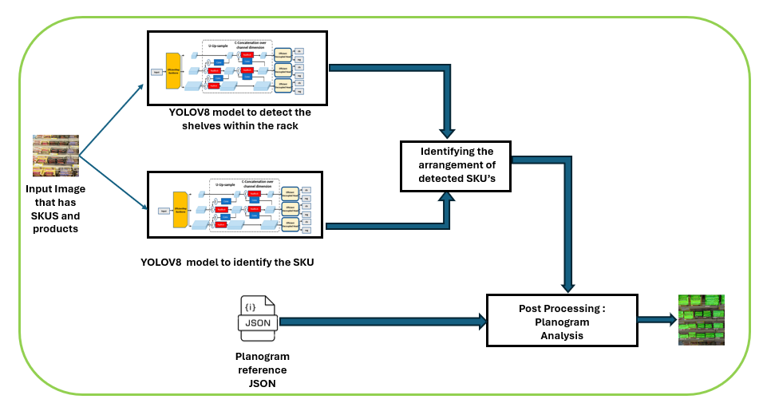
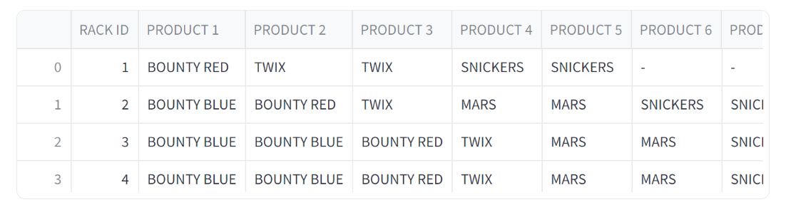
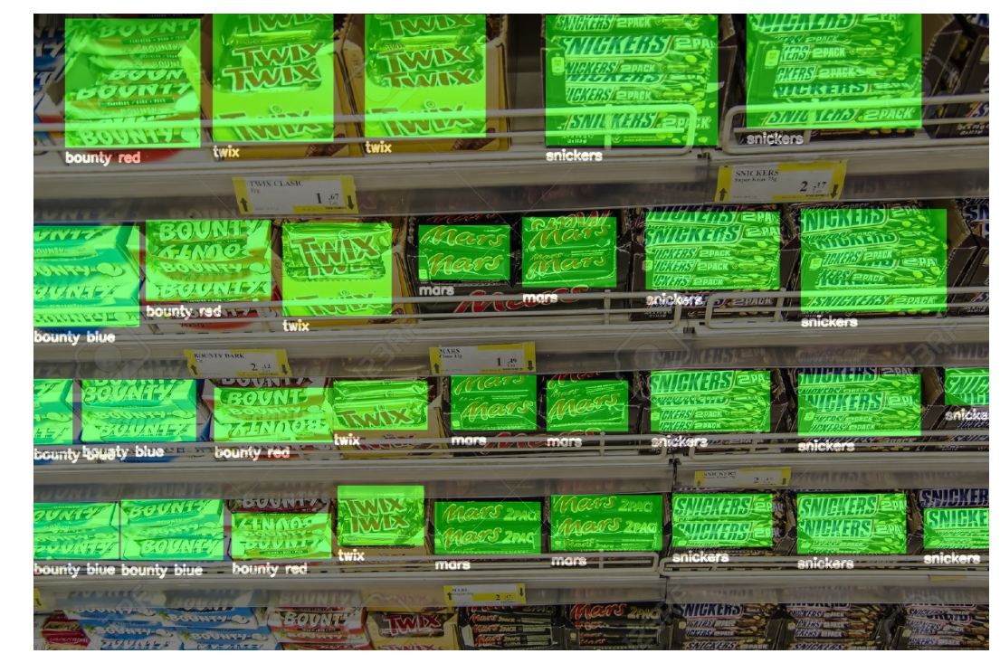
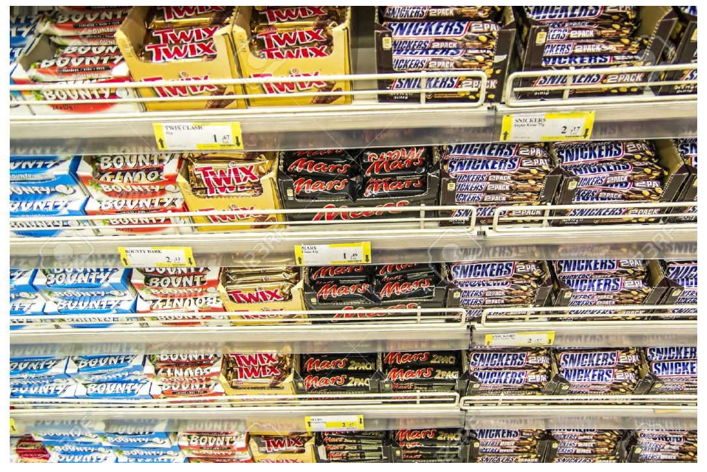
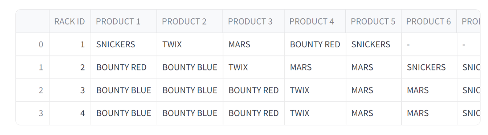
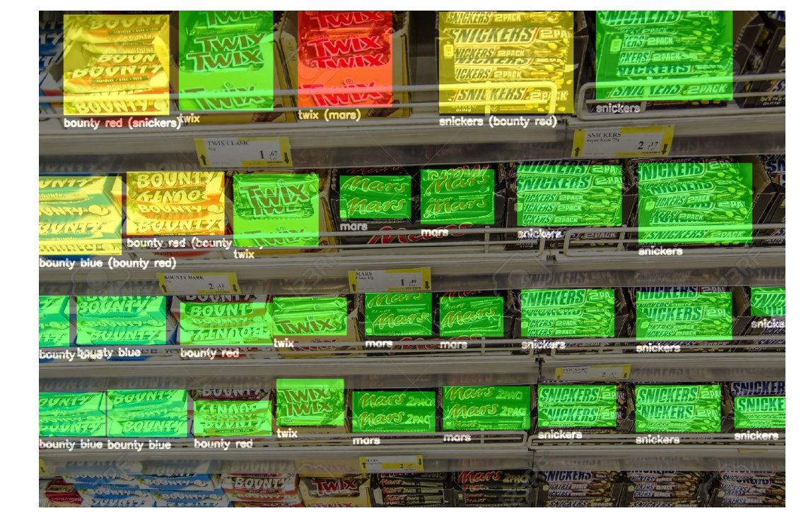

# Planogram_Analysis

## Table of Contents

1. [Introduction](#introduction)
2. [Solution Architecture](#solution-architecture)
3. [Tools/Models Used](#toolsmodels-used)
4. [Installation](#installation)
5. [Results](#results)

## Introduction

The objective of the planogram analysis is to identify different SKUs arranged in a rack using object detection model and compare it against the reference planogram design. The program identifies the SKUs arranged in differently from the reference design and also identifies SKUs that are not present in the shelf (out of stock) from the given image.

## Solution Architecture

The overview of the implementation is represented in the below diagram

- **Shelf Detection**: YOLOV8 object detection trained model that will identify the shelf in the given input image.

- **SKU Detection**: The SKU's will be detected using YOLOV8 Object detection trained model.
  
- **Planogram Analysis**:Detected objects/products will be compared with the Planogram design to anlayse if the products arrangement is done in correct way in the input image and the anlaysed image will be shared as output.
The color information on the output image resembles as below:
  *Green - Planogram compliant
  *Yellow - Misplaced
  *Red - OSA - On-Shelf Availability




## Models/Tools Used

The list of the models that are used for the implementation given below:

- **Model1**: YOLOV8 model to detect the shelves that are present in the rack.
- **Model2**: YOLOV8 model to detect the store keeping unit(SKU) and the products that are present in the SKU.


## Installation

Follow these steps to set up the project on your local machine:

```bash
cd repository
$ pip install -r requirements.txt

``` 
After installing all the required libraries, now let's run the file after opening terminal in src folder
```bash
$ streamlit run app.py
```
## Results
*Input1.*

*Planogram Design1.*

*Planogram Analysis1.*


*Input2.*

*Planogram Design2.*

*Planogram Analysis2.*

