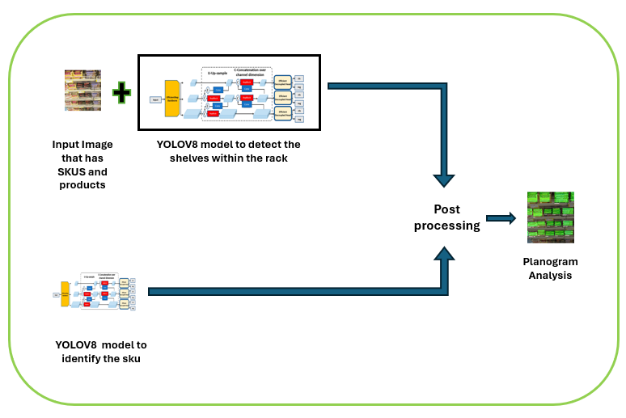
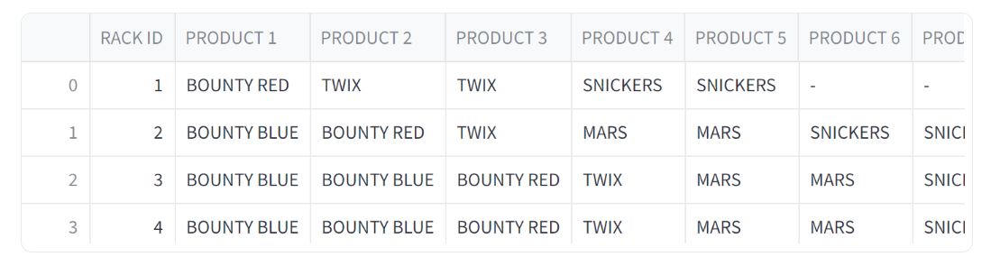
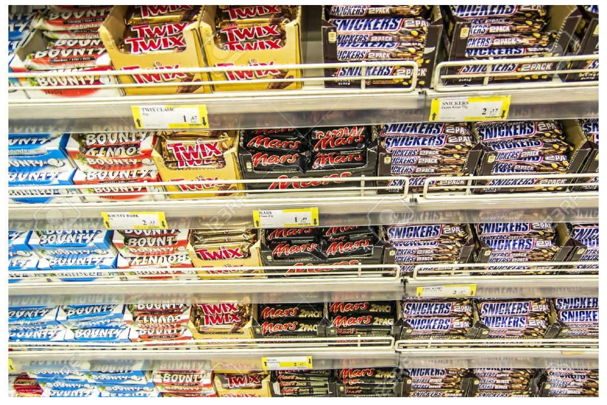
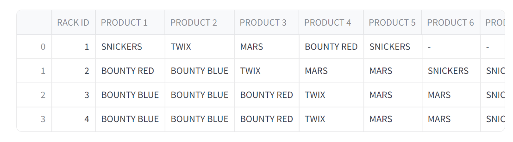
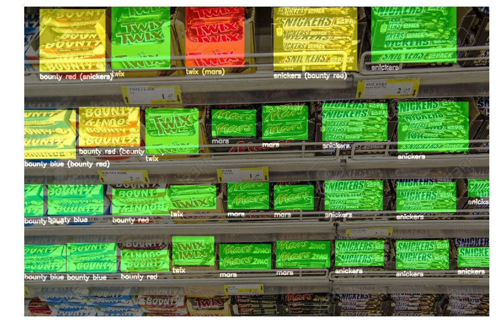

# Planogram_Analysis

## Table of Contents

1. [Introduction](#introduction)
2. [Solution Architecture](#solution-architecture)
3. [Tools/Models Used](#toolsmodels-used)
4. [Installation](#installation)
5. [Results](#results)

## Introduction

The main objective of this usecase is to identify the shelves that are present in the rack using the trained YOLOV8 model and in the next step SKU(store keeping units) are detected using the other YOLOV8 model. The resultant image is compared with the given planogram design to analyse the products allignment is correct or incorrect along with if any SKUS are in out of stock or empty condition. 

## Solution Architecture

The overview of the implementation is represented in the below diagram

- **Shelf Detection**: In this application user needs to upload an Image that will detect shelves using YOLOV8 Object detection trained model.
  
- **SKU Detection**: In the next step of the process the SKU's will be detected using YOLOV8 Object detection trained model. Detected objects/products will be compared with the Planogram design to anlayse if the products arrangement is done in correct in the input image and the anlaysed image will be shared as output.

Include diagrams if available:




## Models/Tools Used

The list of the models that are used for the implementation given below:

- **Model1**: YOLOV8 model to detect the shelves that are prsent in the rack.
- **Model2**: YOLOV8 model to detect the store keeping unit(SKU) and the products that are present in the SKU.


## Installation

Follow these steps to set up the project on your local machine:

```bash
cd repository
$ pip install -r requirements.txt

``` 
After installing all the required libraries, now let's run the file after opening terminal in src folder
```bash
$ streamlit run app.py
```
## Results
*Input1.*

*Planogram Design1.*

*Planogram Analysis1.*


*Input2.*

*Planogram Design2.*

*Planogram Analysis2.*

